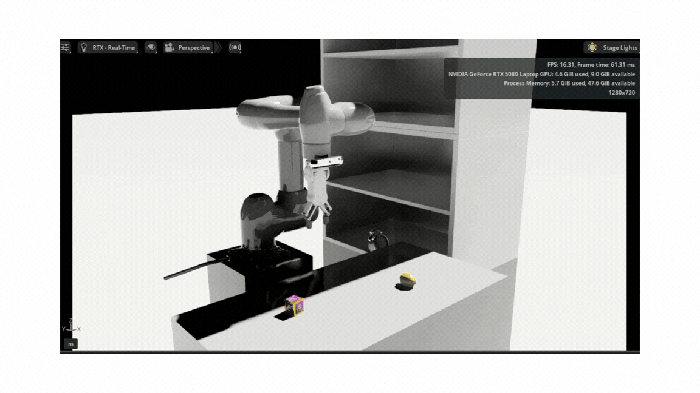

# Smartwarehouse

Smart warehouse simulation using **Isaac Sim**, **Docker**, and **Doosan M0609** robot.  
Isaac Sim workspace version: **5.0.0**, Python **3.10**.  

A smart warehouse simulation featuring YOLO-based object detection and robot pick-and-place manipulation.

---

## 목차 (Table of Contents)

- [기능 (Features)](#기능-features)
- [기술 스택 (Tech stack) 및 환경](#기술-스택tech-stack-및-환경environment)
- [시스템 구조 (System Architecture)](#시스템-구조(System-Architecture))
- [데모 영상 (demo video)](#데모-영상)
- [Troubleshooting](#Trouble-shooting)
- [의존성 (dependencies)](#의존성-dependencies)
- [폴더 구조 (Folder Structure)](#폴더-구조-folder-structure)
- [설치 및 빌드 (Installation & Build)](#설치-및-빌드-installation--build)
- [실행 방법 (How to run)](#실행-방법-how-to-run)
- [Change Log](#change-log)
- [라이선스 (License)](#라이선스-license)

---

## 기능 (Features)

- YOLO-based Object Detection
- Doosan Robot Language (DRL) Control
- Isaac Sim Robot-Gripper Configuration
- Pick & Place Workflow
- Main Control Base Action

---
## 기술 스택(Tech stack) 및 환경(Environment)

#### 1. 운영체제 및 미들웨어 (Infrastructure)
- **OS** : Ubuntu 22.04
- **Middleware** : ROS2 Humble
- **Container** : Docker

#### 2. 시뮬레이션 및 가상 환경 (Simulation)
- **Simulator** : Isaac Sim 5.0.0
- **Robot Model** : Doosan Robot M0609
- **Gripper Model** : OnRobot RG2

#### 3. 인공지능 및 비전 (AI & Computer Vision)
- **Object Detection** : YOLOv8n
- **Vision Library** : OpenCV, PyTorch / TensorFlow

#### 4. 로봇 제어 (Control & Planning)
- **Motion Planning** : DSL
- **Language** : Python 3.10

---
## 시스템 구조(System Architecture)
```bash
Camera (Isaac Sim)
      ↓
YOLO Detection
      ↓
ROS2 Main Controller
      ↓
Doosan Robot API
      ↓
RG2 Gripper Pick & Place
```
---
## 데모 영상


## Troubleshooting

During development, several integration issues arose between Isaac Sim, ROS2, YOLO, and the Doosan Robot API.
These problems and their solutions are documented here:

[Troubleshooting Document](docs/TROUBLESHOOTING.md)

---
## 의존성 (Dependencies)

#### ROS2 Packages
The following ROS2 packages are required:

```bash
sudo apt-get install \
ros-humble-gazebo-ros2-control \
ros-humble-hardware-interface-testing \
ros-humble-ament-cmake-clang-format
```
#### Python Libraries
```bash
pip install \
numpy==1.24.3 \
opencv-python==4.8.1.78 \
torch==2.10.0 \
torchvision==0.25.0 \
ultralytics==8.4.9 \
ultralytics-thop==2.0.18
```
--
## 폴더 구조 (Folder Structure)

```bash
smartwarehouse
├── config/                   # 인식 및 로봇 설정을 위한 설정 파일 (pose.yaml 등)
├── dataset/                  # YOLO 모델 학습을 위한 이미지 및 레이블 데이터
├── launch/                   # ROS2 노드 실행을 위한 런치 파일 (dsr_bringup)
├── onrobot2/                 # OnRobot 그리퍼(RG2/RG6) 관련 리소스 및 URDF/Mesh
│   ├── meshes/               # 그리퍼의 3D 모델 파일 (.stl)
│   ├── urdf/                 # 로봇 결합을 위한 URDF 및 XACRO 설정
│   └── onrobot/              # Isaac Sim 연동을 위한 USD 설정 파일
├── smartwarehouse/           # 핵심 소스 코드 (Main Logic)
│   ├── main_controller.py    # 전체 시스템 제어 메인 루프
│   ├── base_action.py        # 로봇 기본 동작 정의
│   ├── gripper_controller.py # OnRobot 그리퍼 제어 로직
│   ├── yolo.py               # 객체 인식 추론 스크립트
│   └── replicator_script.py  # Isaac Sim Replicator 데이터 생성 스크립트
├── USD/                      # Isaac Sim 프로젝트 파일 (.usd)
│   ├── m0609_rg2_final.usd   # 두산 M0609 + RG2 그리퍼 통합 모델
│   └── smartwarehouse.usd    # 스마트 물류 창고 환경 씬(Scene)
├── yolo_dockerfile/          # yolo 환경 구축을 위한 Dockerfile
└── best.pt                   # YOLOv8 학습 완료 모델 가중치 (best.pt 등)
```

---

## 설치 및 빌드 (Installation & Build)
#### 1. 저장소 클론
```bash
git clone https://github.com/isaac-sim/IsaacSim-ros_workspaces.git
cd IsaacSim_ros-workspaces/humble/src
git clone https://github.com/DoosanRobotics/doosan-robot2.git
git clone https://github.com/username/Smartwarehouse.git
```
#### 2. Doosan emulator install
- [doosan-robot2 git link](#https://github.com/DoosanRobotics/)
#### 2. ROS2 빌드 (Workspace)
```bash
cd ~/IsaacSim-ros_workspaces/humble_ws
rosdep install -i --from-path src --rosdistro $ROS_DISTRO -y
colcon build
```

## 실행 방법 (How to run)

#### 1. Isaac Sim 실행 및 프로젝트 열기
```bash
# isaac sim 실행
./isaacsim/isaac-sim.sh
# Isaac Sim에서 아래 USD 파일 열기
/home/rokey/IsaacSim-ros_workspaces/humble_ws/src/smartwarehouse/USD/smartwarehouse.usd 
```
#### 2. 실행 환경 설정 및 DRL control node 켜기
```bash
#새 터미널에서
source ~/IsaacSim-ros_workspaces/humble_ws/install/setup.bash
source /opt/ros/humble/setup.bash
ros2 launch smartwarehouse dsr_bringup.launch.py
```
#### 3. 실행 환경 설정 및 main controller 실행
```bash
# 새 터미널에서
source ~/IsaacSim-ros_workspaces/humble_ws/install/setup.bash
source /opt/ros/humble/setup.bash
ros2 run smartwarehouse main
```

## Change Log
- 0.1  : README edit
- 0.2  : Add gripper (OnRobot RG2) and assemble with robot arm (Doosan M0609)
- 0.3  : Make Environment (USD)
- 0.4  : ROS Setting
- 0.5  : Delete conveyor
- 0.6  : DSR Node setting
- 0.7  : DSR Node Modify
- 0.8  : DSR Test Code add
- 1.0  : Sample Code add
- 1.1  : Main Controller code add
- 1.2  : Move home code add
- 1.3  : Waypoint code add
- 1.4  : Pick2conveyor add
- 1.5  : Place2shelf add
- 1.6  : Setting TCP
- 1.7  : Find pose for pose.yaml
- 1.8  : Model direction change
- 1.9  : Robot renew
- 1.10 : Movel test clock pick and place
- 2.1  : YOLO data make with Isaac Sim Replicator
- 2.2  : Transfer replicator file to YOLO file
- 2.3  : YOLO training with Docker
- 2.4  : Test best.pt with Docker 
- 2.5  : Action test 

## Reference
#### 참고 문헌 (Reference)
- [Doosan Robotics GitHub](https://github.com/DoosanRobotics/doosan-robot2) - 두산 로봇 ROS 2 공식 드라이버 및 DRL 가이드
- [NVIDIA Isaac Sim Docs](https://docs.isaacsim.omniverse.nvidia.com/5.0.0/index.html) - Isaac Sim 공식 문서
- [Ultralytics YOLOv8](https://github.com/ultralytics/ultralytics) - YOLOv8 모델 학습 및 추론
- [OnRobot ROS 2 Support](https://github.com/UniversalRobots/Universal_Robots_ROS2_Driver) - OnRobot 그리퍼 통합 참조

## Acknowledgements

이 프로젝트는 Doosan Robotics의 산업용 로봇 제어 언어(DRL)와 NVIDIA의 디지털 트윈 기술을 결합하여 스마트 물류 자동화 가능성을 탐색하기 위해 진행되었습니다.

도움을 준 오픈소스 커뮤니티와 관련 라이브러리 개발자분들에게 감사드립니다.

## 라이선스 (License)

MIT License © 2026 DoYoung Kim
